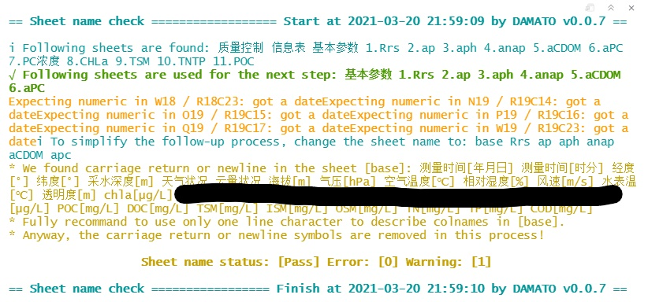

<!-- README.md is generated from README.Rmd. Please edit that file -->

# DAMATO 

Current version: 0.0.7

<!-- badges: start -->

[](https://travis-ci.com/bishun945/DAMATO)
[](https://ci.appveyor.com/project/bishun945/damato)
[](https://circleci.com/gh/bishun945/DAMATO/tree/circleci-project-setup)
[](https://www.tidyverse.org/lifecycle/#experimental)
[](https://CRAN.R-project.org/package=DAMATO)
[](https://mybinder.org/v2/gh/bishun945/DAMATO/master)
<!-- badges: end -->

The goal of `DAMATO` is to automatically assess the MS spreadsheets
recording in situ data by:

-   **Format check** includes sheetname check, sampleID check, base info
    check, etc.;
-   **Generate a skeleton** by the pre-defined spreadsheet format (easy
    to use when start to data collection);
-   **Produce assessment figures** includes parameters comparison,
    relationships between AOPs (or IOPs) and OACs, geolocation map and
    so on.

The present built-in spreadsheet format only supports the lab of
Prof. Yunmei Li in Nanjing Normal University. If you want to customize
the spreadsheet format, you can consult Prof. Li for more details via
<bishun1994@foxmail.com> and cc to <liyunmei@njnu.edu.cn>.

## Installation

You can install the released version of DAMATO from [My
Github](https://github.com/bishun945/DAMATO) with:

``` r
install.packages("devtools") # install devtools require
devtools::install_github('DAMATO', build_vignettes=TRUE)
```

## Supported spread formats

run `data(DAMATO::dataset_format_1)` to see more details about one of
supported formats.

## Format check

If you are getting start to data collection, use generage function like
this:

``` r
library(DAMATO)
Generate_ref_spread()
```

Then a MS spreadsheet file will be created in fold `spreads` in your
working directory. Just add your records to this file. Once you finish
your collection, use `Check functions` to make sure the format is okay.

``` r
fn  = file.choose() # select your spreadsheet file
res_1 = Check_sheet_name(fn)
res_2 = Check_sample_id(res_1)
res_3 = Check_base_info(res_2)
res_4 = Check_geo_location(res_3)
```

The above `Check functions` are merged to one main function which could
be more convenient for users. But it is okay if you want to check a
specific item, such as `sheet name` or `sample id`.

It is better to use `%>%` for these successional functions.
`res = Check_sheet_name(fn) %>% Check_sample_id()`

``` r
res = Check_format(fn)
```

## Quatliy check (coming soon)

When all format stuff are passed, the more important thing is to check
the quality of data set you collect. Use `Check_param_quality()` and
`Check_spectra_quality()` to inspect (interactively to some extent) the
quality and flag them by `qualtiy_flag()`.

``` r
res_5 = Check_param_quality(res_4) # coming soon
res_6 = Check_spectra_quality(res_5) # coming soon
res_7 = Quatliy_flag(res_6) # coming soon
```

## Example

### Check\_sheet\_name

``` r
fn = "/foo/bar/foobar.xlsx"
tmp <- Check_sheet_name(fn, excel_option = "readxl")
```

The result is shown as follows:



> These warning messages mean the colnames in \[base\] sheet has some
> carriage returns or newlines. But this does not matter for the
> follow-up process. Thus, the number of warnings is 1.

### Check\_sample\_id

``` r
fn = "/foo/bar/foobar.xlsx"
tmp <- Check_sheet_name(fn, excel_option = "readxl") %>%
  Check_sample_id()
```


> These messages mean that the first columns of head have been replaced
> by `SampleID` for matching the \[base\] sheet. However, in the \[apc\]
> sheet, several samples (masked) have been found in error SampleID
> format. Check the raw excel file and try to re-submit! The final
> message of `Sample ID status:` presents `Error` which means there is
> unable to do the follow-up process.
